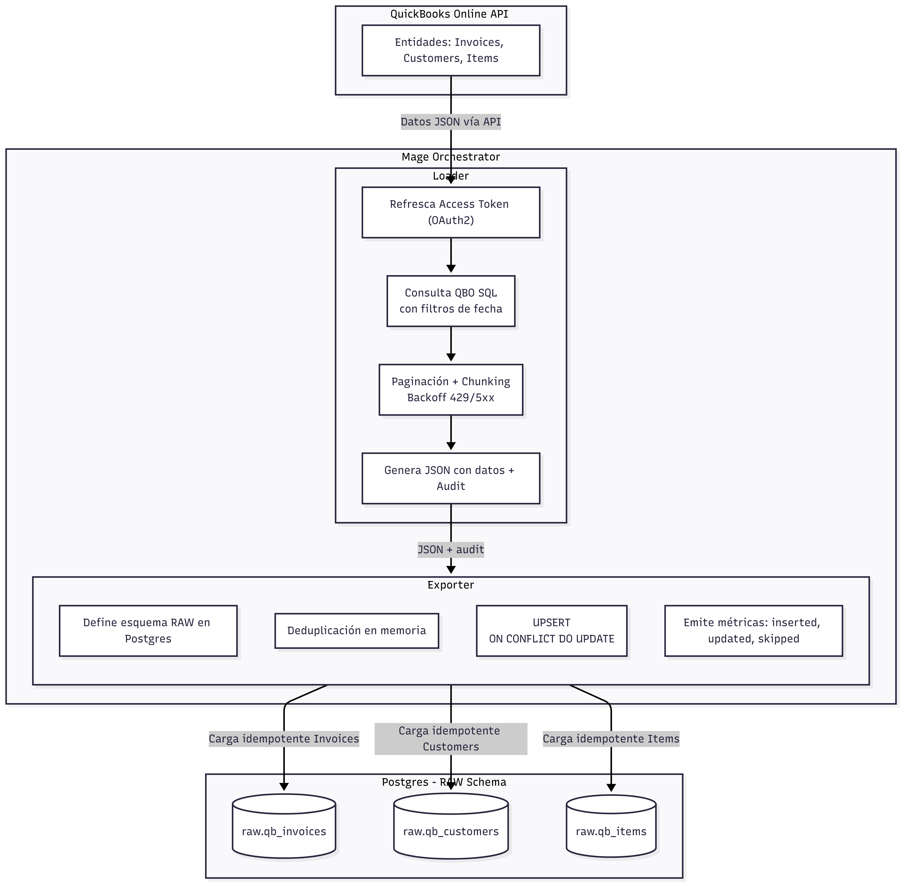
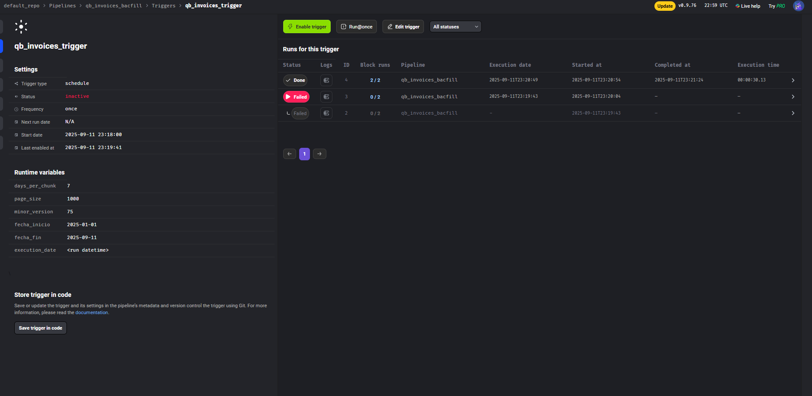

# Backfill QuickBooks Online (QBO) → Postgres con Mage


La arquitectura del proyecto se encarga de obtener datos históricos sandbox de la API de QuickBooks para poder almacenarlos en una base de datos. 

La arquitectura de cada pipeline en el orquestador *Mage* es la siguiente:

En el loader, obtenemos la información de la api en formato JSON, calculamos las métricas solicitadas y pasamos la información al exporter.

En el exporter, definimos el esquema raw de las tablas de la base de datos, definimos un template de que información se espera en cada columna, obtenemos el json payload y subimos a *Postgres*


## Características principales

- Segmentación de rangos `[fecha_inicio, fecha_fin)` en: `day | week | month | quarter | year` (UTC).  
- Extracción vía API QBO **OAuth2**.  
- Paginación completa con **backoff exponencial + jitter** para evitar problemas de carga.  
- Carga **idempotente** en Postgres (`UPSERT`).  
- Emisión de métricas por batch: páginas, filas, insertados, actualizados, omitidos, duración.  

---

##  Arquitectura



---

##  Cómo levantar el proyecto

1. **Clonar el repositorio**  
   - `git clone https://github.com/AHMEDPUCO/data_mining_1.git`  

2. **Configuramos el .env para poder levantar el postgres**  
   - Definimos valores para:
     * PGUSER=your_username
     * PGPASSWORD=your_password
     * PGDATABASE=your_database
     * PGADMIN_EMAIL=your_email
     * PGADMIN_PASSWORD=your_password
   - 
2. **Levantamos el contenedor**  
   - `docker compose up -d`  

3. **Ingresar a la UI de mage**  
   - En el navegador: [http://localhost:6789](http://localhost:6789)  

4. **Abrir pgAdmin**  
   - Validar conexión al Postgres.  
---

###  Gestión de secretos (propósito/rotación/responsables)
| Nombre              | Propósito                                   | Rotación recomendada              | Responsable     |
|---------------------|---------------------------------------------|-----------------------------------|-----------------|
| QBO_CLIENT_ID ,QBO_CLIENT_SECRET      | ID y secreto de la app QBO (OAuth2)                   | Rota según la aplicación         | TI   |
| QBO_REFRESH_TOKEN   | Necesario para poder generar access_token     |Rota por expiración o por cantidad de usos |  TI   |
| QBO_REALM_ID        | Company ID de QBO                           | Estática (por compañía)           | Data Eng        |
| PG_HOST/PORT/DB     | Conexión a Postgres                         | No rota,a menos, que el DBA haga cambios          | Plataforma      |
| PG_USER/PASSWORD    | Credenciales de Postgres                    | No rota, a menos que cambie de usuario                | Plataforma      |

> En la carpeta del proyecto definimos un .env que contiene las credenciales para poder arrancar Postgres. En este caso, subimos un .env.example para que defina las variables y se pueda alzar el postgres.
---

## Pipelines
## Parámetros
Los parametros que le vamos a pasar son los siguientes
- 'chunk_size'
- 'minor_version'
- 'page_size'
- 'fecha_inicio'
- 'fecha_fin'
Estos son ingresados desde el trigger; sin embargo, se ponen valores por default para evitar posibles errores de ejecución.


##Estructura
### `qb_customers_backfill`
- `qb_customer_loader`  
- `qb_customer_exporter`  
  

### `qb_invoices_backfill`
- `qb_invoices_loader`  
- `qb_invoices_exporter`  

### `qb_items_backfill`
- `qb_items_loader`  
- `qb_items_exporter`  

---

## SEGMENTACION CHUNKING
Una vez indicada la fecha de inicio y fecha de fin, creamos varios chunks que van a procesar la información en cierto rango de fecha. Este rango lo definimos nosotros en los parámetros. Esto lo hacemos con el fin de evitar timeouts o respuestas demasiados grandes.

## PAGINACIÓN
La ap de quicbooks limita la cantidad de resultados por request. 
Por lo tanto, implementamos paginación en cada chunk, donde vamos a indicar desde que pagina se empieza y el máximo de resultados por pagina. 
Utilizamos una función para que realice esto varias veces hasta agotar todos los datos.

## LIMITES
QuickBooks tiene límites importantes:
- **Rate limit**: Error 429 (Too Many Requests)
- **Errores 5xx**: Errores internos de QuickBooks
- **Timeouts**: Demasiada información en un solo request

**Manejo en el código:**

- Reintentos automáticos con backoff exponencial + jitter (`sleep` creciente con random).
- `Retry-After` si el header lo indica.
- Máximo de 6 reintentos por request.


##  Triggers One-Time

- **Tipo**: Once 
- **Parametros obligatorias**:  
  - `fecha_inicio`: ISO UTC, ej. `2025-01-01T00:00:00Z`  
  - `fecha_fin`: ISO UTC, ej. `2025-09-11T00:00:00Z`
  - 'chunk_size': default(7)
  - 'minor_version' :default(75)
  - 'page_size': default(1000)

- **Política post-ejecución**: al finalizar, deshabilitar o eliminar el trigger para evitar reejecuciones accidentales.

📸 Evidencia del trigger de un pipeline:  
  


---

##  Esquema RAW
El esquema RAW lo definimos en el exporter
## **Ejemplo de esquema**:
```sql
CREATE SCHEMA IF NOT EXISTS raw;
CREATE TABLE IF NOT EXISTS raw.qb_items (
  id  text PRIMARY KEY,
  payload jsonb NOT NULL,
  ingested_at_utc timestamptz NOT NULL DEFAULT now(),
  extract_window_start_utc timestamptz NOT NULL,
  extract_window_end_utc   timestamptz NOT NULL,
  page_number int,
  page_size   int,
  request_payload jsonb
);
CREATE INDEX IF NOT EXISTS idx_qb_items_ingested_at ON raw.qb_items (ingested_at_utc);
CREATE INDEX IF NOT EXISTS idx_qb_items_win_start   ON raw.qb_items (extract_window_start_utc);
CREATE INDEX IF NOT EXISTS idx_qb_items_win_end     ON raw.qb_items (extract_window_end_utc);
```

### Idempotencia

Para asegurar que los datos puedan cargarse múltiples veces **sin causar duplicados ni inconsistencias**, se aplican dos mecanismos principales:

---

####  1. Uso de UPSERT (Insert or Update)

- Utilizamos sentencias tipo `INSERT ... ON CONFLICT DO UPDATE` (también conocidas como *upserts*).
- Esto permite que:
  - Si el registro **ya existe**, se actualiza.
  - Si el registro **no existe**, se inserta.
- Beneficios:
  - Evita insertar duplicados.
  - Garantiza que los datos más recientes reemplacen a los anteriores de forma segura.
  - No es necesario borrar datos previamente cargados.

---

####  2. Función `deduplicate` en el exporter

- Antes de enviar los datos a la base de datos, se aplica una función de deduplicación.
- Esta función limpia los registros duplicados **dentro del mismo batch**.
- Beneficios:
  - Evita múltiples intentos de insertar el mismo registro.
  - Reduce la cantidad de operaciones innecesarias sobre la base de datos (mejor rendimiento).
  - Mejora la consistencia de los datos procesados.

---

##  Validaciones y Volumetría

# Validaciones y Volumetría – QBO Backfill
##  ¿Cuándo se ejecutan las validaciones?

Las validaciones se corren **automáticamente al ejecutar el pipeline** desde Mage. Para analizarlas:

1. Ejecuta el trigger desde la UI o vía API.
2. Revisa los logs generados por:
   - El bloque **loader** (extracción y particionamiento por chunks)
   - El bloque **exporter** (envío de datos a base de datos)

---

##  Loader – Logs

Durante la ejecución del `loader`, se imprime información sobre cada página procesada, incluyendo:
Página 1: 7 filas en 0.48s (start=1)
Chunk 32: 2025-08-06T00:00:00+00:00 → 2025-08-12T23:59:59+00:00

###  ¿Qué significa cada parte?

- `Página 1`: número de página devuelta por la fuente de datos.
- `7 filas`: cantidad de registros devueltos en esa página.
- `start=1`: posición inicial del chunk en la paginación total.
- `0.48s`: tiempo que tomó procesar esa página.
- `Chunk 32`: número de chunk que cubre el rango de fechas siguiente.
- `2025-08-06 → 2025-08-12`: intervalo temporal cubierto por ese chunk.

Esta información permite validar:
- Que **todas las páginas** están siendo procesadas.
- Que no hay **saltos o superposiciones** en los chunks de fechas.
- Cuánto **demora cada carga parcial**.

---

##  Exporter – Logs y su interpretación

En el bloque `exporter`, se imprimen logs detallando cómo se insertan los datos en la base de datos:

Batch INVOICES: 10 (inserted=10, updated=0, skipped=0)
Batch INVOICES: 10 (inserted=10, updated=0, skipped=0)
Batch INVOICES: 3 (inserted=3, updated=0, skipped=0)
Carga INVOICES: 23 filas en 0.12s (inserted=23, updated=0, skipped=0)

###  ¿Cómo interpretar estos logs?

- Cada línea `Batch INVOICES` representa un batch procesado.
- `inserted`: filas nuevas agregadas.
- `updated`: filas que ya existían y fueron modificadas.
- `skipped`: filas ignoradas (por duplicados o validaciones).
- Línea final `Carga`: resumen total del proceso.

Estos logs ayudan a validar que:
- La carga fue **exitosa**.
- Los datos fueron correctamente **insertados o actualizados**.
- No se están **omitiendo** registros importantes.
- Aeguran la volumetría y la idempotencia(al volver a correr si en skipped sale el numero total de filas , significa que no hubo duplicaciones)

---

## Verificación de Volumetría

La volumetría se puede verificar en tres niveles:

1. **Loader:** verifica cuántas filas se reciben por página o chunk.
2. **Exporter:** verifica cuántas filas se insertan, actualizan o se omiten.
3. **Base de datos:** usa una consulta SQL (`SELECT COUNT(*) ...`) para validar el número total de filas realmente insertadas en la tabla.

Al comparar los totales entre estas tres etapas, puedes confirmar si la carga fue completa y correcta.


---

##  Troubleshooting

###  Autenticación
Para no tener problemas de autenticación, debemos asegurarnos de tener configurados correctamente los secretos.
En el caso de tener errores relacionados al acces_token, cambiar el refresh token.


###  Paginación
Para la paginación, usamos start position y maxresults para comprobar que revisamos toda la pagina. Considerar que los chunks siempre van a iniciar en 1 para no perder información. Si no empezamos en 1, podríamos perder datos.


###  Límites
Respecto a los limites, definimos estrategias como el backoff + jitter y un numero máximo de intentos. Además, tomamos en cuenta también el valor devuelto por los headers como alternativa al backoff.

- Si se recibe error 429, se reintenta hasta 6 veces con backoff.
- Reduzca la granularidad (`days_per_chunk`) si hay muchos errores por límite.

###  Timezones
Todas las fechas están en UTC, Los timestamps de QBO incluyen zona horaria.


###  Almacenamiento
Los datos se insertan en las bases de datos respectivas e implementamos upsert y función de deduplicación para asegurar la integridad de los datos ingresaods. Si cambiamos el payload, se actualiza el registro.

###  Permisos
- El token debe tener acceso a la entidad consultada (`Item`, `Invoice`, etc.).
- El usuario de DB debe tener permisos de escritura.

## Checklist de Aceptación

- [x] Mage y Postgres se comunican por nombre de servicio.  
- [x] Todos los secretos están en Mage (no en el repo).  
- [x] Pipelines aceptan `fecha_inicio` y `fecha_fin` en UTC.  
- [x] Trigger one-time configurado, ejecutado y luego deshabilitado.  
- [x] Esquema RAW creado con payload completo y metadatos.  
- [x] Idempotencia verificada (`ON CONFLICT`).  
- [x] Paginación y rate limits manejados y documentados.  
- [x] Validaciones de volumetría registradas como evidencia.  
- [x] Runbook de reintentos y reanudación disponible.  

---
